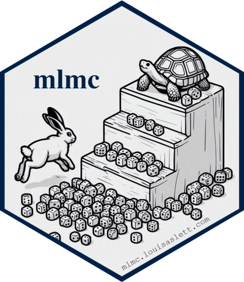

# mlmc R package 
[](https://www.repostatus.org/#active)
[](https://www.gnu.org/licenses/gpl-2.0.html)
[](https://cran.r-project.org/package=mlmc)
[](https://cran.r-project.org/package=mlmc)
[](https://louisaslett.r-universe.dev/mlmc)

An implementation of Multi-level Monte Carlo for R.  This package builds on the original GPL-2 Matlab and C++ implementations by Mike Giles (see <https://people.maths.ox.ac.uk/~gilesm/mlmc/>) to provide a full MLMC driver and example level samplers.  Multi-core parallel sampling of levels is provided built-in.

## Contact

Please feel free to:

* submit suggestions and bug-reports at: <https://github.com/louisaslett/mlmc/issues>
* compose an e-mail to: <louis.aslett@durham.ac.uk>, <nagapetyan@stats.ox.ac.uk> or <vollmer@stats.ox.ac.uk>

## Install

You can install the latest release directly from
[CRAN](https://cran.r-project.org/package=mlmc).

```r
install.packages("mlmc")
```

Or you can install the latest binary from r-universe:

```r
install.packages("mlmc", repos = c("https://louisaslett.r-universe.dev", "https://cloud.r-project.org"))
```

## Install development version (not recommended)

Installing directly from [GitHub](https://github.com) is not supported by the
`install.packages` command. You could use the
[devtools](https://cran.r-project.org/package=devtools) package
to install the development version if desired.

```r
install.packages("devtools")
devtools::install_github("louisaslett/mlmc")
```

Under releases, the tree/commit from which CRAN releases were made are recorded,
so historic source can be downloaded from there.

## Acknowledgements

Louis Aslett was supported by the i-like programme grant (EPSRC grant reference number EP/K014463/1 <http://www.i-like.org.uk>) when this package was first conceived.  Tigran Nagapetyan and Sebastian Vollmer were supported by EPSRC Grant EP/N000188/1.

## Citation

If you use this software, please cite:

Aslett, L. J. M., Giles, M. B., Nagapetyan, T. and Vollmer, S. J. (2016), *mlmc: Multi-Level Monte Carlo*.  R package. <https://CRAN.R-project.org/package=mlmc>

```bibtex
@Manual{mlmcpkg,
  title = {mlmc: Multi-Level Monte Carlo},
  author = {Aslett, L. J. M. and Giles, M. B. and Nagapetyan, T. and Vollmer, S. J.},
  year = {2016},
  note = {R package},
  url = {https://CRAN.R-project.org/package=mlmc},
}
```

Thank-you.
